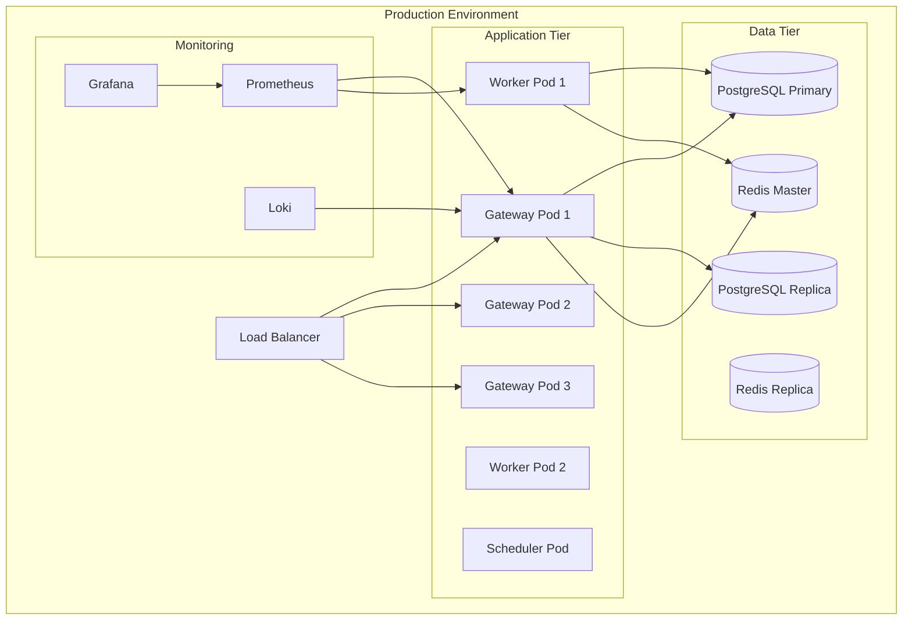

# MS5.0 Manufacturing System - Build & Deployment Guide

## Table of Contents

1. [Prerequisites](#prerequisites)
2. [System Requirements](#system-requirements)
3. [Environment Setup](#environment-setup)
4. [Build Process](#build-process)
5. [Deployment Strategies](#deployment-strategies)
6. [Multi-Device Deployment](#multi-device-deployment)
7. [Production Deployment](#production-deployment)
8. [Monitoring & Verification](#monitoring--verification)
9. [Troubleshooting](#troubleshooting)
10. [Rollback Procedures](#rollback-procedures)

## Prerequisites

### Required Software

```bash
# Core Requirements
Node.js: v18.0.0 or higher (v20.x recommended)
pnpm: v8.0.0 or higher
Docker: v24.0.0 or higher
Docker Compose: v2.20.0 or higher
Kubernetes: v1.28 or higher (for production)
Helm: v3.12.0 or higher

# Database Requirements
PostgreSQL: v15.0 or higher
TimescaleDB: v2.13.0 or higher
Redis: v7.2.0 or higher

# Monitoring Stack
Prometheus: v2.45.0 or higher
Grafana: v10.0.0 or higher
Loki: v2.9.0 or higher
```

### Development Tools

```bash
# Install Node.js (using nvm)
curl -o- https://raw.githubusercontent.com/nvm-sh/nvm/v0.39.0/install.sh | bash
nvm install 20
nvm use 20

# Install pnpm
npm install -g pnpm@latest

# Install Docker Desktop (macOS/Windows)
# Download from https://www.docker.com/products/docker-desktop

# Install kubectl
curl -LO "https://dl.k8s.io/release/$(curl -L -s https://dl.k8s.io/release/stable.txt)/bin/$(uname -s | tr '[:upper:]' '[:lower:]')/$(uname -m)/kubectl"
chmod +x kubectl
sudo mv kubectl /usr/local/bin/

# Install Helm
curl https://raw.githubusercontent.com/helm/helm/main/scripts/get-helm-3 | bash
```

## System Requirements

### Minimum Requirements (Development)

- **CPU**: 4 cores (x86_64 or ARM64)
- **RAM**: 8GB
- **Storage**: 20GB available
- **Network**: 100 Mbps

### Recommended Requirements (Production)

- **CPU**: 16 cores (x86_64 or ARM64)
- **RAM**: 32GB
- **Storage**: 100GB SSD
- **Network**: 1 Gbps

### Supported Platforms

- **Linux**: Ubuntu 22.04 LTS, RHEL 9, Amazon Linux 2023
- **macOS**: 13.0 (Ventura) or higher
- **Windows**: Windows 10/11 with WSL2
- **Cloud**: AWS EKS, Azure AKS, Google GKE
- **Edge Devices**: Raspberry Pi 4, NVIDIA Jetson

## Environment Setup

### 1. Clone Repository

```bash
# Clone the repository
git clone https://github.com/your-org/manufacturing-dashboard-5.0.git
cd manufacturing-dashboard-5.0

# Checkout production branch
git checkout main
```

### 2. Environment Configuration

```bash
# Copy environment templates
cp .env.example .env
cp .env.production.example .env.production

# Edit environment variables
nano .env
```

### 3. Required Environment Variables

```bash
# Database Configuration
DB_HOST=localhost
DB_PORT=5432
DB_NAME=ms5db
DB_USER=ms5user
DB_PASSWORD=<secure-password>
DB_READ_HOST=localhost  # Read replica
DB_WRITE_HOST=localhost # Write primary

# Redis Configuration
REDIS_HOST=localhost
REDIS_PORT=6379
REDIS_PASSWORD=<secure-password>
REDIS_CLUSTER_NODES=localhost:6379

# Authentication (OIDC)
OIDC_ISSUER=https://login.microsoftonline.com/<tenant-id>/v2.0
OIDC_CLIENT_ID=<your-client-id>
OIDC_CLIENT_SECRET=<your-client-secret>
OIDC_REDIRECT_URI=https://ms5.yourdomain.com/auth/callback

# S3 Storage (for archival)
AWS_REGION=eu-west-2
AWS_ACCESS_KEY_ID=<your-access-key>
AWS_SECRET_ACCESS_KEY=<your-secret-key>
S3_BUCKET=ms5-archives
S3_ENDPOINT=https://s3.eu-west-2.amazonaws.com

# Monitoring
PROMETHEUS_ENDPOINT=http://localhost:9090
GRAFANA_ENDPOINT=http://localhost:3000
LOKI_ENDPOINT=http://localhost:3100

# Feature Flags
LAUNCHDARKLY_SDK_KEY=<your-sdk-key>
FEATURE_FLAGS_ENABLED=true

# API Configuration
API_VERSION=v2
API_DEFAULT_VERSION=v2
API_SUPPORTED_VERSIONS=v1,v2,v3
API_DEPRECATED_VERSIONS=v1
```

## Build Process

### 1. Install Dependencies

```bash
# Install all dependencies
pnpm install

# Install production dependencies only
pnpm install --prod
```

### 2. Build TypeScript

```bash
# Build all packages
pnpm build

# Build specific service
pnpm --filter @ms5/gateway build
pnpm --filter @ms5/shared build

# Build with watch mode (development)
pnpm build:watch
```

### 3. Run Tests

```bash
# Run all tests
pnpm test

# Run specific test suites
pnpm test:unit
pnpm test:integration
pnpm test:e2e

# Run validation suite
bash validate-fixes.sh
```

### 4. Build Docker Images

```bash
# Build all images
docker-compose build

# Build multi-architecture images
docker buildx create --use
docker buildx build --platform linux/amd64,linux/arm64 \
  -t ms5/gateway:latest \
  -f services/ms5.0-gateway/Dockerfile \
  --push .

# Build specific services
docker build -t ms5/gateway:latest -f services/ms5.0-gateway/Dockerfile .
docker build -t ms5/worker:latest -f services/ms5.0-worker/Dockerfile .
docker build -t ms5/scheduler:latest -f services/ms5.0-scheduler/Dockerfile .
```

## Deployment Strategies

### Local Development Deployment

#### 1. Start Infrastructure

```bash
# Start databases and cache
docker-compose up -d postgres timescale redis

# Wait for services to be ready
./scripts/wait-for-services.sh

# Run database migrations
pnpm migrate:dev

# Seed development data
pnpm seed:dev
```

#### 2. Start Services

```bash
# Start all services in development mode
pnpm dev

# Or start individual services
pnpm --filter @ms5/gateway dev
pnpm --filter @ms5/worker dev
pnpm --filter @ms5/scheduler dev
```

#### 3. Access Applications

```
Gateway API: http://localhost:4000
GraphQL Playground: http://localhost:4000/graphql
Prometheus: http://localhost:9090
Grafana: http://localhost:3000
Redis Commander: http://localhost:8081
```

### Docker Compose Deployment

#### 1. Production Build

```bash
# Build production images
docker-compose -f docker-compose.yml -f docker-compose.prod.yml build

# Start all services
docker-compose -f docker-compose.yml -f docker-compose.prod.yml up -d

# Scale services
docker-compose up -d --scale gateway=3 --scale worker=5
```

#### 2. Health Checks

```bash
# Check service health
docker-compose ps
docker-compose exec gateway curl http://localhost:4000/health

# View logs
docker-compose logs -f gateway
docker-compose logs -f --tail=100 worker
```

## Multi-Device Deployment

### Edge Device Deployment (Raspberry Pi/Jetson)

#### 1. Prepare Edge Device

```bash
# SSH into edge device
ssh pi@192.168.1.100

# Install Docker
curl -fsSL https://get.docker.com | sh
sudo usermod -aG docker $USER

# Install k3s (lightweight Kubernetes)
curl -sfL https://get.k3s.io | sh -
```

#### 2. Deploy Edge Stack

```yaml
# edge-deployment.yaml
apiVersion: apps/v1
kind: Deployment
metadata:
  name: ms5-edge
spec:
  replicas: 1
  selector:
    matchLabels:
      app: ms5-edge
  template:
    metadata:
      labels:
        app: ms5-edge
    spec:
      containers:
        - name: gateway
          image: ms5/gateway:latest-arm64
          resources:
            limits:
              memory: '512Mi'
              cpu: '1000m'
          env:
            - name: NODE_ENV
              value: 'edge'
            - name: EDGE_MODE
              value: 'true'
            - name: SYNC_INTERVAL
              value: '300'
```

```bash
# Deploy to edge
kubectl apply -f edge-deployment.yaml

# Configure edge-to-cloud sync
kubectl create configmap edge-config \
  --from-file=edge-config.json
```

### Mobile/Tablet Deployment (PWA)

#### 1. Build PWA

```bash
# Build Progressive Web App
cd apps/ms5-pwa
pnpm build

# Generate service worker
pnpm generate-sw

# Build for offline capability
pnpm build:offline
```

#### 2. Deploy PWA

```nginx
# nginx.conf for PWA
server {
    listen 443 ssl http2;
    server_name ms5.yourdomain.com;

    ssl_certificate /etc/ssl/certs/ms5.crt;
    ssl_certificate_key /etc/ssl/private/ms5.key;

    root /var/www/ms5-pwa;

    location / {
        try_files $uri $uri/ /index.html;
        add_header Cache-Control "public, max-age=3600";
    }

    location /api {
        proxy_pass http://gateway:4000;
        proxy_http_version 1.1;
        proxy_set_header Upgrade $http_upgrade;
        proxy_set_header Connection 'upgrade';
    }

    location /sw.js {
        add_header Cache-Control "no-cache";
    }
}
```

### Multi-Region Deployment

#### 1. Configure Regions

```yaml
# regions.yaml
regions:
  eu-west:
    primary: true
    database: ms5-eu-west.cluster.amazonaws.com
    redis: ms5-eu-west.cache.amazonaws.com

  us-east:
    primary: false
    database: ms5-us-east.cluster.amazonaws.com
    redis: ms5-us-east.cache.amazonaws.com

  ap-south:
    primary: false
    database: ms5-ap-south.cluster.amazonaws.com
    redis: ms5-ap-south.cache.amazonaws.com
```

#### 2. Deploy to Multiple Regions

```bash
# Deploy to EU West
kubectl config use-context eu-west
helm install ms5 ./charts/ms5 -f values/eu-west.yaml

# Deploy to US East
kubectl config use-context us-east
helm install ms5 ./charts/ms5 -f values/us-east.yaml

# Deploy to AP South
kubectl config use-context ap-south
helm install ms5 ./charts/ms5 -f values/ap-south.yaml
```

## Production Deployment

### Kubernetes Deployment

#### 1. Create Namespace and Secrets

```bash
# Create namespace
kubectl create namespace ms5-production

# Create secrets
kubectl create secret generic ms5-db \
  --from-literal=password=$DB_PASSWORD \
  -n ms5-production

kubectl create secret generic ms5-oidc \
  --from-literal=client-id=$OIDC_CLIENT_ID \
  --from-literal=client-secret=$OIDC_CLIENT_SECRET \
  -n ms5-production

# Create configmaps
kubectl create configmap ms5-config \
  --from-file=config.json \
  -n ms5-production
```

#### 2. Deploy with Helm

```bash
# Add Helm repository
helm repo add ms5 https://charts.ms5.io
helm repo update

# Install with production values
helm install ms5 ms5/ms5-system \
  --namespace ms5-production \
  --values values.production.yaml \
  --set image.tag=v1.0.0 \
  --set ingress.enabled=true \
  --set ingress.hosts[0].host=ms5.yourdomain.com \
  --set postgresql.enabled=true \
  --set redis.enabled=true \
  --set monitoring.enabled=true
```

#### 3. Production values.yaml

```yaml
# values.production.yaml
replicaCount:
  gateway: 3
  worker: 5
  scheduler: 2

autoscaling:
  enabled: true
  minReplicas: 3
  maxReplicas: 10
  targetCPUUtilizationPercentage: 70
  targetMemoryUtilizationPercentage: 80

resources:
  gateway:
    requests:
      memory: '1Gi'
      cpu: '500m'
    limits:
      memory: '2Gi'
      cpu: '2000m'
  worker:
    requests:
      memory: '512Mi'
      cpu: '250m'
    limits:
      memory: '1Gi'
      cpu: '1000m'

postgresql:
  enabled: true
  auth:
    database: ms5db
    username: ms5user
  primary:
    persistence:
      size: 100Gi
      storageClass: gp3
  readReplicas:
    persistence:
      size: 100Gi

redis:
  enabled: true
  architecture: replication
  master:
    persistence:
      size: 10Gi
  replica:
    replicaCount: 2
    persistence:
      size: 10Gi

ingress:
  enabled: true
  className: nginx
  annotations:
    cert-manager.io/cluster-issuer: letsencrypt-prod
    nginx.ingress.kubernetes.io/rate-limit: '100'
  tls:
    - secretName: ms5-tls
      hosts:
        - ms5.yourdomain.com

monitoring:
  prometheus:
    enabled: true
    retention: 30d
  grafana:
    enabled: true
    adminPassword: <secure-password>
  loki:
    enabled: true
    retention: 7d
```

### AWS EKS Deployment

#### 1. Create EKS Cluster

```bash
# Create cluster with eksctl
eksctl create cluster \
  --name ms5-production \
  --region eu-west-2 \
  --nodegroup-name standard-workers \
  --node-type t3.large \
  --nodes 3 \
  --nodes-min 3 \
  --nodes-max 10 \
  --managed

# Install AWS Load Balancer Controller
kubectl apply -k "github.com/aws/eks-charts/stable/aws-load-balancer-controller/crds"
helm install aws-load-balancer-controller eks/aws-load-balancer-controller \
  -n kube-system \
  --set clusterName=ms5-production
```

#### 2. Deploy RDS and ElastiCache

```terraform
# terraform/rds.tf
resource "aws_db_instance" "ms5_primary" {
  identifier             = "ms5-production"
  engine                 = "postgres"
  engine_version        = "15.4"
  instance_class        = "db.r6g.xlarge"
  allocated_storage     = 100
  storage_encrypted     = true

  db_name  = "ms5db"
  username = "ms5admin"
  password = var.db_password

  backup_retention_period = 30
  backup_window          = "03:00-04:00"
  maintenance_window     = "sun:04:00-sun:05:00"

  enabled_cloudwatch_logs_exports = ["postgresql"]

  tags = {
    Name        = "ms5-production"
    Environment = "production"
  }
}

resource "aws_elasticache_replication_group" "ms5_redis" {
  replication_group_id       = "ms5-production"
  replication_group_description = "MS5 Production Redis Cluster"
  engine                     = "redis"
  node_type                  = "cache.r6g.large"
  number_cache_clusters      = 3
  automatic_failover_enabled = true
  multi_az_enabled          = true

  at_rest_encryption_enabled = true
  transit_encryption_enabled = true

  snapshot_retention_limit = 7
  snapshot_window         = "03:00-05:00"

  tags = {
    Name        = "ms5-production"
    Environment = "production"
  }
}
```

#### 3. Deploy Application

```bash
# Apply Terraform
cd terraform
terraform init
terraform plan
terraform apply

# Get RDS endpoint
RDS_ENDPOINT=$(terraform output -raw rds_endpoint)
REDIS_ENDPOINT=$(terraform output -raw redis_endpoint)

# Update Helm values
helm upgrade ms5 ms5/ms5-system \
  --namespace ms5-production \
  --set postgresql.enabled=false \
  --set externalDatabase.host=$RDS_ENDPOINT \
  --set redis.enabled=false \
  --set externalRedis.host=$REDIS_ENDPOINT
```

## Monitoring & Verification

### Health Checks

#### 1. Application Health

```bash
# Check gateway health
curl https://ms5.yourdomain.com/health

# Expected response:
{
  "status": "healthy",
  "timestamp": "2025-09-16T10:00:00Z",
  "services": {
    "database": "healthy",
    "redis": "healthy",
    "worker": "healthy"
  },
  "version": "1.0.0"
}
```

#### 2. Database Health

```bash
# Check PostgreSQL
kubectl exec -it ms5-postgresql-0 -- pg_isready

# Check Redis
kubectl exec -it ms5-redis-master-0 -- redis-cli ping
```

### Prometheus Metrics

```bash
# Port forward Prometheus
kubectl port-forward svc/prometheus 9090:9090

# Key metrics to monitor:
- ms5_http_requests_total
- ms5_http_request_duration_seconds
- ms5_database_connections_active
- ms5_database_query_duration_seconds
- ms5_redis_cache_hits_total
- ms5_websocket_connections_active
```

### Grafana Dashboards

```bash
# Port forward Grafana
kubectl port-forward svc/grafana 3000:3000

# Import dashboards:
1. MS5 Operational Dashboard (ID: 15000)
2. Database Performance (ID: 15001)
3. Redis Metrics (ID: 15002)
4. Business Metrics (ID: 15003)
```

### Log Aggregation

```bash
# View logs with Loki
kubectl logs -l app=ms5-gateway --tail=100

# Query logs with LogQL
{app="ms5-gateway"} |= "error"
{app="ms5-worker"} | json | duration > 1000
```

## Troubleshooting

### Common Issues

#### 1. Database Connection Issues

```bash
# Problem: Cannot connect to database
# Solution:
kubectl describe pod ms5-gateway-xxx
kubectl logs ms5-gateway-xxx

# Check database credentials
kubectl get secret ms5-db -o jsonpath='{.data.password}' | base64 -d

# Test connection
kubectl run -it --rm debug --image=postgres:15 --restart=Never -- \
  psql -h postgres-service -U ms5user -d ms5db
```

#### 2. Redis Connection Issues

```bash
# Problem: Redis connection refused
# Solution:
kubectl get pods -l app=redis
kubectl logs redis-master-0

# Test Redis connection
kubectl run -it --rm debug --image=redis:7 --restart=Never -- \
  redis-cli -h redis-master ping
```

#### 3. Memory Issues

```bash
# Problem: OOMKilled pods
# Solution:
kubectl top nodes
kubectl top pods

# Increase memory limits
kubectl set resources deployment/ms5-gateway \
  --limits=memory=4Gi --requests=memory=2Gi
```

#### 4. Performance Issues

```bash
# Problem: Slow response times
# Solution:
# Check database slow queries
kubectl exec -it ms5-postgresql-0 -- \
  psql -U ms5user -d ms5db -c "SELECT * FROM pg_stat_statements ORDER BY mean_exec_time DESC LIMIT 10;"

# Check Redis slow log
kubectl exec -it redis-master-0 -- redis-cli slowlog get 10

# Enable query monitoring
kubectl set env deployment/ms5-gateway QUERY_MONITORING=true
```

### Debug Mode

```bash
# Enable debug logging
kubectl set env deployment/ms5-gateway LOG_LEVEL=debug
kubectl set env deployment/ms5-worker LOG_LEVEL=debug

# Enable Node.js debugging
kubectl set env deployment/ms5-gateway NODE_OPTIONS="--inspect=0.0.0.0:9229"
kubectl port-forward deployment/ms5-gateway 9229:9229
```

## Rollback Procedures

### Application Rollback

#### 1. Helm Rollback

```bash
# List releases
helm list -n ms5-production

# Check history
helm history ms5 -n ms5-production

# Rollback to previous version
helm rollback ms5 -n ms5-production

# Rollback to specific revision
helm rollback ms5 3 -n ms5-production
```

#### 2. Kubectl Rollback

```bash
# Check rollout history
kubectl rollout history deployment/ms5-gateway

# Rollback to previous version
kubectl rollout undo deployment/ms5-gateway

# Rollback to specific revision
kubectl rollout undo deployment/ms5-gateway --to-revision=2

# Monitor rollback
kubectl rollout status deployment/ms5-gateway
```

### Database Rollback

#### 1. Migration Rollback

```bash
# Connect to database pod
kubectl exec -it ms5-postgresql-0 -- bash

# Run migration rollback
pnpm migrate:rollback

# Or manual rollback
psql -U ms5user -d ms5db < /migrations/rollback/v1.0.0.sql
```

#### 2. Restore from Backup

```bash
# List available backups
aws s3 ls s3://ms5-backups/postgres/

# Download backup
aws s3 cp s3://ms5-backups/postgres/backup-2025-09-16.sql.gz .

# Restore backup
gunzip backup-2025-09-16.sql.gz
kubectl exec -i ms5-postgresql-0 -- \
  psql -U ms5user -d ms5db < backup-2025-09-16.sql
```

### Emergency Procedures

#### 1. Circuit Breaker Activation

```bash
# Enable maintenance mode
kubectl create configmap maintenance --from-literal=enabled=true
kubectl set env deployment/ms5-gateway MAINTENANCE_MODE=true

# Redirect traffic to fallback
kubectl patch service ms5-gateway -p '{"spec":{"selector":{"version":"fallback"}}}'
```

#### 2. Complete System Recovery

```bash
# Stop all services
kubectl scale deployment --all --replicas=0 -n ms5-production

# Clear Redis cache
kubectl exec -it redis-master-0 -- redis-cli FLUSHALL

# Restart services in order
kubectl scale deployment ms5-postgresql --replicas=1
kubectl wait --for=condition=ready pod -l app=postgresql --timeout=300s

kubectl scale deployment ms5-redis --replicas=1
kubectl wait --for=condition=ready pod -l app=redis --timeout=300s

kubectl scale deployment ms5-gateway --replicas=3
kubectl scale deployment ms5-worker --replicas=5
kubectl scale deployment ms5-scheduler --replicas=2
```

## Post-Deployment Verification

### Smoke Tests

```bash
# Run smoke tests
pnpm test:smoke

# Manual verification
curl https://ms5.yourdomain.com/api/v2/health
curl https://ms5.yourdomain.com/api/v2/metrics
```

### Load Testing

```bash
# Run load tests with autocannon
npx autocannon \
  -c 100 \
  -d 60 \
  -p 10 \
  https://ms5.yourdomain.com/api/v2/lines

# Run stress tests
pnpm test:stress
```

### Security Scanning

```bash
# Scan Docker images
docker scan ms5/gateway:latest

# Scan Kubernetes manifests
kubectl score manifests/

# Run security audit
pnpm audit
```

## Support & Resources

### Documentation

- Operations Guide: `docs/OPERATIONS.md`
- API Documentation: `docs/API.md`
- Security Guide: `docs/SECURITY.md`
- Developer Portal: `docs/DEVELOPER_PORTAL.md`
- Disaster Recovery: `docs/DISASTER_RECOVERY.md`

### Monitoring URLs

- Production: https://ms5.yourdomain.com
- Grafana: https://grafana.ms5.yourdomain.com
- Prometheus: https://prometheus.ms5.yourdomain.com
- Logs: https://logs.ms5.yourdomain.com

### Support Channels

- Email: ms5-support@yourdomain.com
- Slack: #ms5-production
- On-Call: PagerDuty integration
- Documentation: https://docs.ms5.yourdomain.com

## Appendix

### A. Complete Deployment Checklist

#### Pre-Deployment

- [ ] Environment variables configured
- [ ] Secrets created in Kubernetes
- [ ] Database migrations tested
- [ ] Docker images built and pushed
- [ ] Security scan completed
- [ ] Load testing completed
- [ ] Rollback plan documented

#### Deployment

- [ ] Database deployed and verified
- [ ] Redis deployed and verified
- [ ] Application deployed
- [ ] Ingress configured
- [ ] SSL certificates active
- [ ] DNS records updated
- [ ] Health checks passing

#### Post-Deployment

- [ ] Smoke tests passing
- [ ] Monitoring active
- [ ] Alerting configured
- [ ] Logs aggregating
- [ ] Performance metrics baseline
- [ ] Documentation updated
- [ ] Team notified

### B. Architecture Diagrams



### C. Deployment Scripts

Save these helper scripts in `scripts/` directory:

#### deploy.sh

```bash
#!/bin/bash
set -e

ENV=${1:-production}
VERSION=${2:-latest}

echo "Deploying MS5 $VERSION to $ENV"

# Load environment
source .env.$ENV

# Build images
docker-compose build

# Push to registry
docker-compose push

# Deploy to Kubernetes
kubectl apply -f k8s/$ENV/

# Wait for rollout
kubectl rollout status deployment/ms5-gateway

# Run smoke tests
./scripts/smoke-test.sh $ENV

echo "Deployment complete!"
```

#### rollback.sh

```bash
#!/bin/bash
set -e

ENV=${1:-production}
REVISION=${2:-0}

echo "Rolling back MS5 in $ENV to revision $REVISION"

if [ $REVISION -eq 0 ]; then
    kubectl rollout undo deployment/ms5-gateway
    kubectl rollout undo deployment/ms5-worker
else
    kubectl rollout undo deployment/ms5-gateway --to-revision=$REVISION
    kubectl rollout undo deployment/ms5-worker --to-revision=$REVISION
fi

kubectl rollout status deployment/ms5-gateway
kubectl rollout status deployment/ms5-worker

echo "Rollback complete!"
```

---

**Document Version**: 1.0.0 **Last Updated**: 2025-09-16 **Status**: PRODUCTION READY

This deployment guide provides comprehensive instructions for deploying the MS5.0 Manufacturing
System across multiple environments and devices. Follow the procedures carefully and ensure all
verification steps are completed before considering the deployment successful.
